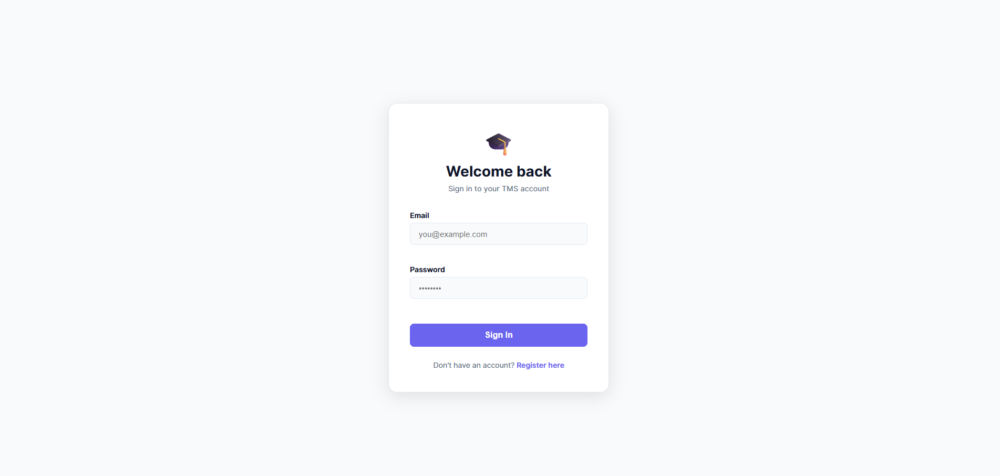
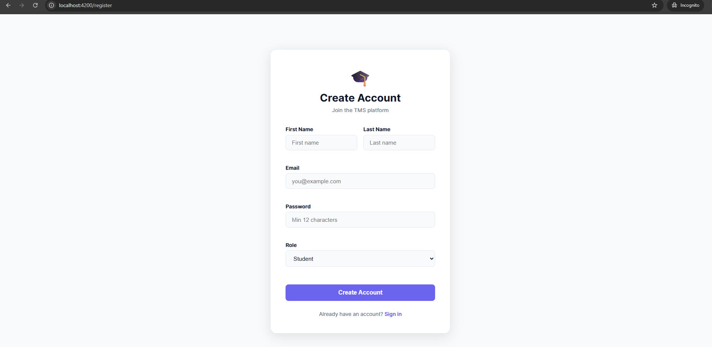
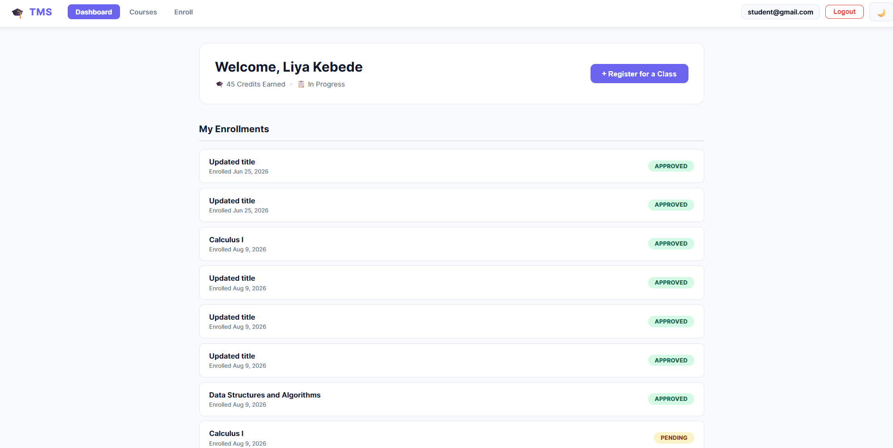
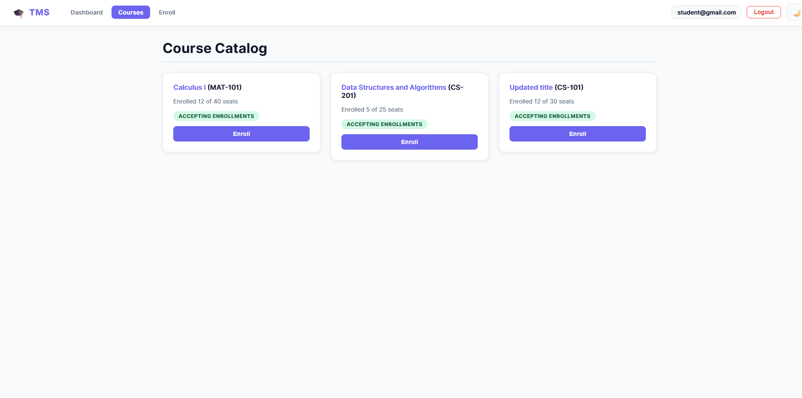
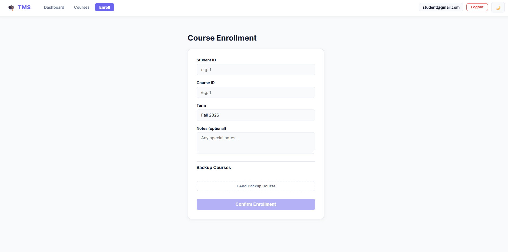
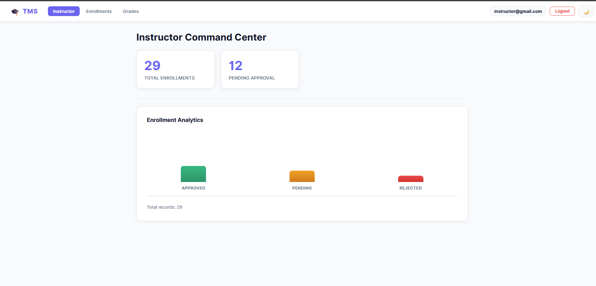
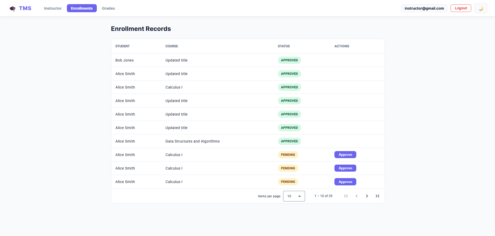
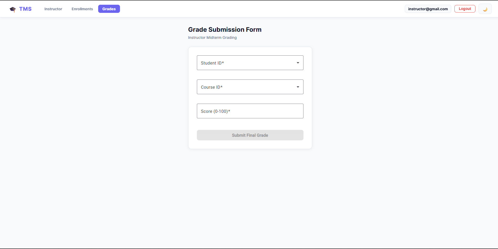

# TMS Client — Training Management System

Angular frontend for the CoTBE Training Management System (TMS). The application provides the user-facing interface for authentication, course management, enrollment management, and the instructor Command Center.

---

## 📸 Screenshots

### Login


### Register


### Student Dashboard


### Course Catalog


### Course Enrollment


### Instructor Command Center


### Enrollment Records


### Grade Submission


---

## 🛠️ Tech Stack

| Concern      | Technology              |
|--------------|-------------------------|
| Framework    | Angular                 |
| Language     | TypeScript              |
| UI           | HTML / SCSS             |
| Routing      | Angular Router          |
| HTTP         | Angular HttpClient      |
| Testing      | Jasmine / Karma         |
| E2E Testing  | Playwright              |
| API          | ASP.NET Core 10 REST API|

---

## 📁 Project Structure

```
Tms-client/
├── src/
│   │   index.html
│   │   main.ts
│   │   proxy.conf.json
│   │   styles.scss
│   │
│   ├── app/
│   │   │   app.component.ts
│   │   │   app.config.ts
│   │   │   app.html
│   │   │   app.routes.ts
│   │   │   app.scss
│   │   │   app.spec.ts
│   │   │   app.ts
│   │   │
│   │   ├── features/
│   │   │   ├── auth/
│   │   │   │   ├── login/
│   │   │   │   │       login.component.html
│   │   │   │   │       login.component.scss
│   │   │   │   │       login.component.ts
│   │   │   │   └── register/
│   │   │   │           register.component.html
│   │   │   │           register.component.scss
│   │   │   │           register.component.ts
│   │   │   ├── course-detail/
│   │   │   │       course-detail.component.html
│   │   │   │       course-detail.component.scss
│   │   │   │       course-detail.component.ts
│   │   │   ├── course-list/
│   │   │   │       course-list.component.html
│   │   │   │       course-list.component.scss
│   │   │   │       course-list.component.ts
│   │   │   ├── enrollment-form/
│   │   │   │       enrollment-form.component.html
│   │   │   │       enrollment-form.component.scss
│   │   │   │       enrollment-form.component.ts
│   │   │   ├── enrollment-list/
│   │   │   │       enrollment-list.component.html
│   │   │   │       enrollment-list.component.scss
│   │   │   │       enrollment-list.component.ts
│   │   │   ├── grade-submission/
│   │   │   │       grade-submission.component.html
│   │   │   │       grade-submission.component.scss
│   │   │   │       grade-submission.component.spec.ts
│   │   │   │       grade-submission.component.ts
│   │   │   ├── instructor-dashboard/
│   │   │   │       instructor-dashboard.component.html
│   │   │   │       instructor-dashboard.component.scss
│   │   │   │       instructor-dashboard.component.ts
│   │   │   ├── student-dashboard/
│   │   │   │       student-dashboard.component.html
│   │   │   │       student-dashboard.component.scss
│   │   │   │       student-dashboard.component.ts
│   │   │   └── unauthorized/
│   │   │           unauthorized.component.html
│   │   │           unauthorized.component.scss
│   │   │           unauthorized.component.ts
│   │   │
│   │   ├── guards/
│   │   │       role.guard.ts
│   │   │
│   │   ├── interceptors/
│   │   │       credentials.interceptor.ts
│   │   │       error.interceptor.ts
│   │   │       jwt.interceptor.ts
│   │   │
│   │   ├── models/
│   │   │       course.model.ts
│   │   │       enrollment.model.ts
│   │   │
│   │   ├── services/
│   │   │       auth.service.ts
│   │   │       course.service.ts
│   │   │       enrollment.service.spec.ts
│   │   │       enrollment.service.ts
│   │   │       grade.service.spec.ts
│   │   │       grade.service.ts
│   │   │       live-sync.ts
│   │   │
│   │   ├── store/
│   │   │       course.store.ts
│   │   │       enrollment.store.ts
│   │   │
│   │   └── ui/
│   │       ├── analytics-chart/
│   │       │       analytics-chart.component.html
│   │       │       analytics-chart.component.scss
│   │       │       analytics-chart.component.ts
│   │       └── course-card/
│   │               course-card.component.html
│   │               course-card.component.scss
│   │               course-card.component.spec.ts
│   │               course-card.component.ts
│   │
│   └── environments/
│           environment.development.ts
│           environment.ts
│
├── docs/
│   └── screenshots/
├── tests/
├── playwright/
│   └── .auth/
├── playwright-report/
├── public/
├── playwright.config.ts
├── angular.json
├── package.json
└── README.md
```

---

## ✨ Features

### Authentication
- Login page with email and password
- Register page with role selection
- Authentication guard for protected routes
- Admin authentication for E2E tests
- Reusable Playwright authentication state

### Courses
- Course card component
- Course catalog with seat availability
- Enrollment action from course list
- Course detail view

### Enrollments
- Retrieve enrollments from the API
- Approve or reject student enrollments
- Enrollment form with backup courses
- HTTP request/response testing

### Grades
- Grade submission form for instructors
- Midterm grading with student and course selection

### Dashboards
- Student dashboard — enrolled courses and status
- Instructor Command Center — analytics and enrollment management

### Routing
- `/login` — Login page
- `/register` — Registration page
- `/student-dashboard` — Student view
- `/instructor-dashboard` — Instructor Command Center
- `/courses` — Course catalog
- `/enrollment-form` — Enroll in a course
- `/enrollment-list` — Enrollment records
- `/grade-submission` — Grade submission
- `/unauthorized` — Access denied
- Unknown routes redirect to `/login`

---

## 🔐 Authentication

Protected routes use the application's role guard.

Playwright authentication can be configured using environment variables:

```
TMS_ADMIN_EMAIL
TMS_ADMIN_USER
TMS_ADMIN_PASS
```

Example PowerShell configuration:

```powershell
$env:TMS_ADMIN_EMAIL="admin@example.com"
$env:TMS_ADMIN_PASS="password"
```

> Do not commit real credentials to the repository.

---

## 🚀 Getting Started

### Prerequisites
- Node.js
- npm
- Angular CLI

### Check Node and npm

```bash
node --version
npm --version
```

### 1. Install dependencies

```bash
npm install
```

### 2. Start the development server

```bash
npm start
```

The application will be available at:

```
http://localhost:4200
```

---

## 🧪 Testing

### Unit and Integration Tests

```bash
npm test
```

The project includes tests for:
- App component
- Course card component
- Enrollment service
- Grade service
- HTTP requests and responses
- Enrollment approval

### Playwright E2E Tests

```bash
npx playwright test
```

Run with browser visible:

```bash
npx playwright test --headed
```

Run a specific test:

```bash
npx playwright test tests/example.spec.ts
```

View the HTML report:

```bash
npx playwright show-report
```

---

## 🎭 Playwright Authentication

Playwright uses a reusable authenticated browser state for admin tests.

The authentication setup:
1. Navigates to `/login`
2. Fills the email and password
3. Clicks Sign In
4. Verifies the Command Center heading
5. Saves the authenticated browser state

State is stored at:

```
playwright/.auth/admin.json
```

Add to `.gitignore` if necessary:

```
playwright/.auth/
```

---

## 📡 API Integration

The Angular application communicates with the TMS ASP.NET Core API via HTTP interceptors for JWT authentication, credentials, and error handling.

| Method | Endpoint |
|--------|----------|
| GET    | `/api/enrollments` |
| POST   | `/api/enrollments/{id}/approve` |

---

## 🧩 Development

Start the frontend:

```bash
npm start
```

Start the backend API:

```bash
dotnet run --project TmsApi.Api/TmsApi.Api.csproj
```

> Make sure the API is running before testing features that require backend communication.

---

## 📋 Test Coverage

- Course title rendering
- Course enrollment button events
- Enrollment retrieval and approval
- Grade service operations
- HTTP request methods and URLs
- Application routing
- Authentication flow
- Protected route access
- Browser-based E2E scenarios

---

## 🏗️ Project Goals

This project is part of the CoTBE Software Engineering Programme and demonstrates:

- Component-based Angular development
- Feature-based folder structure
- Service-based API integration
- HTTP interceptors (JWT, credentials, error handling)
- Role-based route guards
- State management with stores
- Unit and integration testing
- Semantic accessibility-based Playwright locators
- Reusable authentication state
- End-to-end browser testing
- Clean Git commit practices

---

## 📄 License

School project — CoTBE Software Engineering Programme 2026.